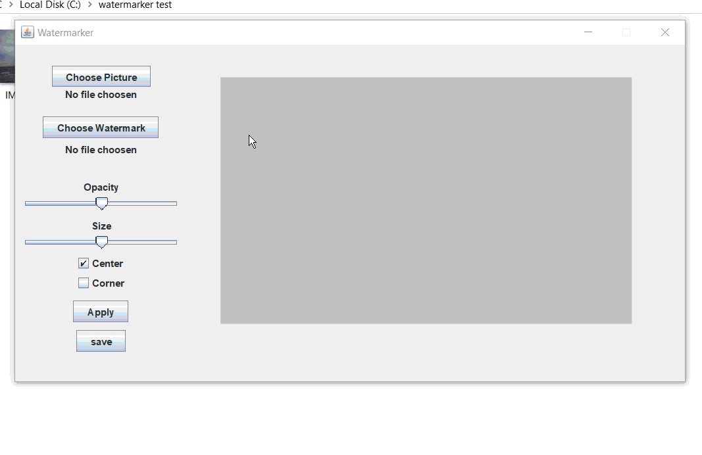

# Watermarker

A java swing gui, that easily lets you watermark pictures. Set things like size and opacity, and the program will make a watermarked copy, so you still have the original.

## How to Run

Install [Java](https://www.java.com/en/download/) from the Oracle website, then run the **Watermarker.jar**

## License

This project is licensed under the MIT License - see the [LICENSE](LICENSE) file for details